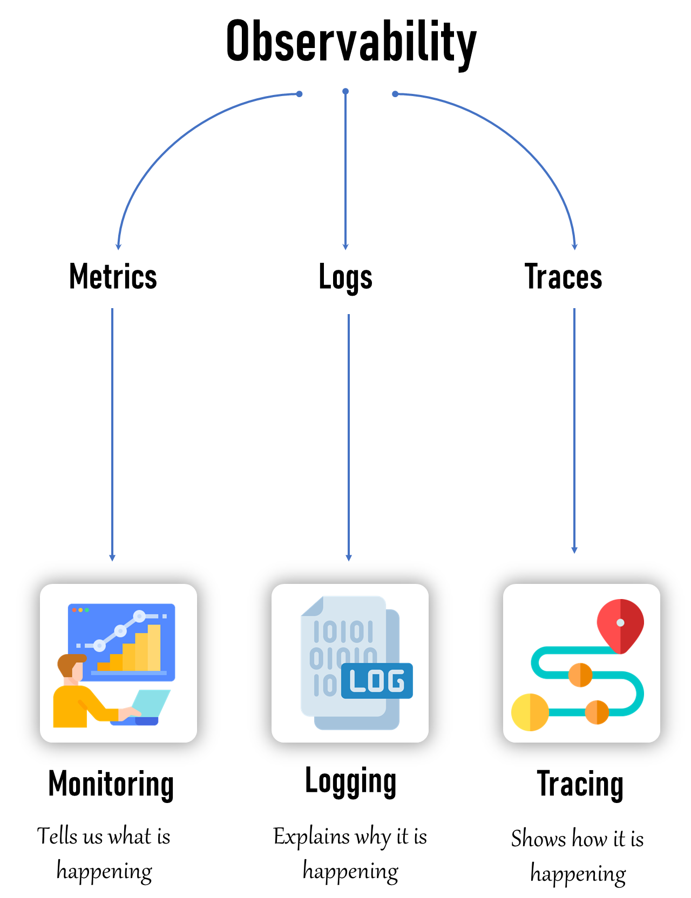

## 💡  Introduction to Observability
- Observability is the ability to understand the internal state of a system by analyzing the data it produces, including logs, metrics, and traces.

- Monitoring(Metrics): involves tracking system metrics like CPU usage, memory usage, and network performance. Provides alerts based on predefined thresholds and conditions
    - `Monitoring tells us what is happening.`
- Logging(Logs):  involves the collection of log data from various components of a system.
    - `Logging explains why it is happening.`
- Tracing(Traces): involves tracking the flow of a request or transaction as it moves through different services and components within a system.
    - `Tracing shows how it is happening.`



## 🤔 Why Monitoring?
- Monitoring helps us keep an eye on our systems to ensure they are working properly.
- Perpose:  maintaining the **health, performance, and security** of IT environments.
- It enables early detection of issues, ensuring that they can be addressed before causing significant downtime or data loss.

- We use monitoring to:
    - Detect Problems Early
    - Measure Performance:
    - Ensure Availability:

## 🤔 Why Observability?
- Observability helps us understand why our systems are behaving the way they are.
- It’s like having a detailed map and tools to explore and diagnose issues.

- We use observability to:
    - Diagnose Issues:
    - Understand Behavior:
    - Improve Systems:


## 🆚 What is the Exact Difference Between Monitoring and Observability?
- 🔥 Monitoring is the *`when and what`* of a system error, and observability is the *`why and how`*

| Category       | Monitoring                                   | Observability                                         |
|----------------|----------------------------------------------|------------------------------------------------------|
| Focus          | Checking if everything is working as expected| Understanding why things are happening in the system  |
| Data           | Collects metrics like CPU usage, memory usage, and error rates | Collects logs, metrics, and traces to provide a full picture |
| Alerts         | Sends notifications when something goes wrong| Correlates events and anomalies to identify root causes |
| Example        | If a server's CPU usage goes above 90%, monitoring will alert us | If a website is slow, observability helps us trace the user's request through different services to find the bottleneck |
| Insight        | Identifies potential issues before they become critical | Helps diagnose issues and understand system behavior |


## 🔭 Does Observability Cover Monitoring?
- Yes!! Monitoring is subset of Observability
- Observability is a broader concept that includes monitoring as one of its components.
- monitoring focuses on tracking specific metrics and alerting on predefined conditions
- observability provides a comprehensive understanding of the system by collecting and analyzing a wider range of data, including **logs, metrics, and traces**.

## 🖥️ What Can Be Monitored?
- Infrastructure: CPU usage, memory usage, disk I/O, network traffic.
- Applications: Response times, error rates, throughput.
- Databases: Query performance, connection pool usage, transaction rates.
- Network: Latency, packet loss, bandwidth usage.
- Security: Unauthorized access attempts, vulnerability scans, firewall logs.

## 👀 What Can Be Observed?
- Logs: Detailed records of events and transactions within the system.
- Metrics: Quantitative data points like CPU load, memory consumption, and request counts.
- Traces: Data that shows the flow of requests through various services and components.

## 🆚 Monitoring on Bare-Metal Servers vs. Monitoring Kubernetes
- Bare-Metal Servers:
    - Direct Access: Easier access to hardware metrics and logs.
    - Fewer Layers: Simpler environment with fewer abstraction layers.

- Kubernetes:
    - Dynamic Environment: Challenges with monitoring ephemeral containers and dynamic scaling.
    - Distributed Nature: Requires tools that can handle distributed systems and correlate data from multiple sources.

## 🆚 Observing on Bare-Metal Servers vs. Observing Kubernetes
- Bare-Metal Servers:
    - Simpler Observability: Easier to collect and correlate logs, metrics, and traces due to fewer components and layers.

- Kubernetes:
    - Complex Observability: Requires sophisticated tools to handle the dynamic and distributed nature of containers and microservices.
    - Integration: Necessitates the integration of multiple observability tools to get a complete picture of the system.

## ⚒️ What are the Tools Available?
- **Monitoring Tools**: Prometheus, Grafana, Nagios, Zabbix, PRTG.
- **Observability Tools**: ELK Stack (Elasticsearch, Logstash, Kibana), EFK Stack (Elasticsearch, FluentBit, Kibana) Splunk, Jaeger, Zipkin, New Relic, Dynatrace, Datadog.


# Monitoring

## Metrics vs Monitoring

Metrics are measurements or data points that tell you what is happening. For example, the number of steps you walk each day, your heart rate, or the temperature outside—these are all metrics.

Monitoring is the process of keeping an eye on these metrics over time to understand what’s normal, identify changes, and detect problems. It's like watching your step count daily to see if you're meeting your fitness goal or checking your heart rate to make sure it's in a healthy range.

## 🚀 Prometheus
- Prometheus is an open-source systems monitoring and alerting toolkit originally built at SoundCloud.
- It is known for its robust data model, powerful query language (PromQL), and the ability to generate alerts based on the collected time-series data.
- It can be configured and set up on both bare-metal servers and container environments like Kubernetes.

## 🏠 Prometheus Architecture
- The architecture of Prometheus is designed to be highly flexible, scalable, and modular.
- It consists of several core components, each responsible for a specific aspect of the monitoring process.


### 🔥 Prometheus Server
- Prometheus server is the core of the monitoring system. It is responsible for scraping metrics from various configured targets, storing them in its time-series database (TSDB), and serving queries through its HTTP API.
- Components:
    - **Retrieval**: This module handles the scraping of metrics from endpoints, which are discovered either through static configurations or dynamic service discovery methods.
    - **TSDB (Time Series Database)**: The data scraped from targets is stored in the TSDB, which is designed to handle high volumes of time-series data efficiently.
    - **HTTP Server**: This provides an API for querying data using PromQL, retrieving metadata, and interacting with other components of the Prometheus ecosystem.
- **Storage**: The scraped data is stored on local disk (HDD/SSD) in a format optimized for time-series data.

### 🌐 Service Discovery
- Service discovery automatically identifies and manages the list of scrape targets (i.e., services or applications) that Prometheus monitors.
- This is crucial in dynamic environments like Kubernetes where services are constantly being created and destroyed.
- Components:
    - **Kubernetes**: In Kubernetes environments, Prometheus can automatically discover services, pods, and nodes using Kubernetes API, ensuring it monitors the most up-to-date list of targets.
    - **File SD (Service Discovery)**: Prometheus can also read static target configurations from files, allowing for flexibility in environments where dynamic service discovery is not used.

### 📤 Pushgateway
- The Pushgateway is used to expose metrics from short-lived jobs or applications that cannot be scraped directly by Prometheus.
- These jobs push their metrics to the Pushgateway, which then makes them available for Prometheus to scrape(pull).
- Use Case:
    - It's particularly useful for batch jobs or tasks that have a limited lifespan and would otherwise not have their metrics collected.

### 🚨 Alertmanager
- The Alertmanager is responsible for managing alerts generated by the Prometheus server.
- It takes care of deduplicating, grouping, and routing alerts to the appropriate notification channels such as PagerDuty, email, or Slack.

### 🧲 Exporters
- Exporters are small applications that collect metrics from various third-party systems and expose them in a format Prometheus can scrape. They are essential for monitoring systems that do not natively support Prometheus.
- Types of Exporters:
    - Common exporters include the Node Exporter (for hardware metrics), the MySQL Exporter (for database metrics), and various other application-specific exporters.

### 🖥️ Prometheus Web UI
- The Prometheus Web UI allows users to explore the collected metrics data, run ad-hoc PromQL queries, and visualize the results directly within Prometheus.

### 📊 Grafana
- Grafana is a powerful dashboard and visualization tool that integrates with Prometheus to provide rich, customizable visualizations of the metrics data.

### 🔌 API Clients
- API clients interact with Prometheus through its HTTP API to fetch data, query metrics, and integrate Prometheus with other systems or custom applications.


## 📊 Metrics in Prometheus:
- Metrics in Prometheus are the core data objects that represent measurements collected from monitored systems.
- These metrics provide insights into various aspects of **system performance, health, and behavior**.

## 🏷️ Labels:
- Metrics are paired with Labels.
- Labels are key-value pairs that allow you to differentiate between dimensions of a metric, such as different services, instances, or endpoints.


## 🔍 Example:
```bash
container_cpu_usage_seconds_total{namespace="kube-system", endpoint="https-metrics"}
```
- `container_cpu_usage_seconds_total` is the metric.
- `{namespace="kube-system", endpoint="https-metrics"}` are the labels.


## 🛠️ What is PromQL?
- PromQL (Prometheus Query Language) is a powerful and flexible query language used to query data from Prometheus.
- It allows you to retrieve and manipulate time series data, perform mathematical operations, aggregate data, and much more.

- 🔑 Key Features of PromQL:
    - Selecting Time Series: You can select specific metrics with filters and retrieve their data.
    - Mathematical Operations: PromQL allows for mathematical operations on metrics.
    - Aggregation: You can aggregate data across multiple time series.
    - Functionality: PromQL includes a wide range of functions to analyze and manipulate data.

## 💡 Basic Examples of PromQL
- `container_cpu_usage_seconds_total`
    - Return all time series with the metric container_cpu_usage_seconds_total
- `container_cpu_usage_seconds_total{namespace="kube-system",pod=~"kube-proxy.*"}`
    - Return all time series with the metric `container_cpu_usage_seconds_total` and the given `namespace` and `pod` labels.
- `container_cpu_usage_seconds_total{namespace="kube-system",pod=~"kube-proxy.*"}[5m]`
    - Return a whole range of time (in this case 5 minutes up to the query time) for the same vector, making it a range vector.

## ⚙️ Aggregation & Functions in PromQL
- Aggregation in PromQL allows you to combine multiple time series into a single one, based on certain labels.
- **Sum Up All CPU Usage**:
    ```bash
    sum(rate(node_cpu_seconds_total[5m]))
    ```
    - This query aggregates the CPU usage across all nodes.

- **Average Memory Usage per Namespace:**
    ```bash
    avg(container_memory_usage_bytes) by (namespace)
    ```
    - This query provides the average memory usage grouped by namespace.

- **rate() Function:**
    - The rate() function calculates the per-second average rate of increase of the time series in a specified range.
    ```bash
    rate(container_cpu_usage_seconds_total[5m])
    ```
    - This calculates the rate of CPU usage over 5 minutes.
- **increase() Function:**
    - The increase() function returns the increase in a counter over a specified time range.
    ```bash
    increase(kube_pod_container_status_restarts_total[1h])
    ```
    - This gives the total increase in container restarts over the last hour.

- **histogram_quantile() Function:**
    - The histogram_quantile() function calculates quantiles (e.g., 95th percentile) from histogram data.
    ```bash
    histogram_quantile(0.95, sum(rate(apiserver_request_duration_seconds_bucket[5m])) by (le))
    ```
    - This calculates the 95th percentile of Kubernetes API request durations.

## 🎛️ Instrumentation
- Instrumentation refers to the process of adding monitoring capabilities to your applications, systems, or services.
- This involves embedding/Writting code or using tools to collect metrics, logs, or traces that provide insights into how the system is performing.

## 🎯 Purpose of Instrumentation:
- **Visibility**: It helps you gain visibility into the internal state of your applications and infrastructure.
- **Metrics Collection**: By collecting key metrics like CPU usage, memory consumption, request rates, error rates, etc., you can understand the health and performance of your system.
- **Troubleshooting**: When something goes wrong, instrumentation allows you to diagnose the issue quickly by providing detailed insights.

## ⚙️ How it Works:
- **Code-Level Instrumentation**: You can add instrumentation directly in your application code to expose metrics. For example, in a `Node.js` application, you might use a library like prom-client to expose custom metrics.

## 📈 Instrumentation in Prometheus:
- 📤 **Exporters**: Prometheus uses exporters to collect metrics from different systems. These exporters expose metrics in a format that Prometheus can scrape and store.
    - **Node Exporter**: Collects system-level metrics from Linux/Unix systems.
    - **MySQL Exporter (For MySQL Database)**:  Collects metrics from a MySQL database.
    - **PostgreSQL Exporter (For PostgreSQL Database)**: Collects metrics from a PostgreSQL database.
- 📊 **Custom Metrics**: You can instrument your application to expose custom metrics that are relevant to your specific use case. For example, you might track the number of user logins per minute.

## 📈 Types of Metrics in Prometheus
- 🔄️ **Counter**:
    - A Counter is a cumulative metric that represents a single numerical value that only ever goes up. It is used for counting events like the number of HTTP requests, errors, or tasks completed.
    - **Example**: Counting the number of times a container restarts in your Kubernetes cluster
    - **Metric Example**: `kube_pod_container_status_restarts_total`

- 📏 **Gauge**:
    - A Gauge is a metric that represents a single numerical value that can go up and down. It is typically used for things like memory usage, CPU usage, or the current number of active users.
    - **Example**: Monitoring the memory usage of a container in your Kubernetes cluster.
    - **Metric Example**: `container_memory_usage_bytes`

- 📊 **Histogram**:
    - A Histogram samples observations (usually things like request durations or response sizes) and counts them in configurable buckets.
    - It also provides a sum of all observed values and a count of observations.
    - **Example**: Measuring the response time of Kubernetes API requests in various time buckets.
    - **Metric Example**: `apiserver_request_duration_seconds_bucket`

- 📝 Summary:
    - Similar to a Histogram, a Summary samples observations and provides a total count of observations, their sum, and configurable quantiles (percentiles).
    - **Example**: Monitoring the 95th percentile of request durations to understand high latency in your Kubernetes API.
    - **Metric Example**: `apiserver_request_duration_seconds_sum`


# 🔍 Logging overview
- Logging is crucial in any distributed system, especially in Kubernetes, to monitor application behavior, detect issues, and ensure the smooth functioning of microservices.


# 🏠 Architecture


## 🚀 Importance:
- **Debugging**: Logs provide critical information when debugging issues in applications.
- **Auditing**: Logs serve as an audit trail, showing what actions were taken and by whom.
- **Performance** Monitoring: Analyzing logs can help identify performance bottlenecks.
- **Security**: Logs help in detecting unauthorized access or malicious activities.

## 🛠️ Tools Available for Logging in Kubernetes
- 🗂️ EFK Stack (Elasticsearch, Fluentbit, Kibana)
- 🗂️ EFK Stack (Elasticsearch, FluentD, Kibana)
- 🗂️ ELK Stack (Elasticsearch, Logstash, Kibana)
- 📊 Promtail + Loki + Grafana

## 📦 EFK Stack (Elasticsearch, Fluentbit, Kibana)
- EFK is a popular logging stack used to collect, store, and analyze logs in Kubernetes.
- **Elasticsearch**: Stores and indexes log data for easy retrieval.
- **Fluentbit**: A lightweight log forwarder that collects logs from different sources and sends them to Elasticsearch.
- **Kibana**: A visualization tool that allows users to explore and analyze logs stored in Elasticsearch.

## 🕵️‍♂️ What is Jaeger?
- Jaeger is an open-source, end-to-end distributed tracing system used for monitoring and troubleshooting microservices-based architectures. It helps developers understand how requests flow through a complex system, by tracing the path a request takes and measuring how long each step in that path takes.

## ❓ Why Use Jaeger?
- In modern applications, especially microservices architectures, a single user request can touch multiple services. When something goes wrong, it’s challenging to pinpoint the source of the problem. Jaeger helps by:

- 🐢 **Identifying bottlenecks**: See where your application spends most of its time.
- 🔍 **Finding root causes of errors**: Trace errors back to their source.
- ⚡ **Optimizing performance**: Understand and improve the latency of services.


## 📚 Core Concepts of Jaeger

- 🛤️ **Trace**: A trace represents the journey of a request as it travels through various services. Think of it as a detailed map that shows every stop a request makes in your system.
- 📏 **Span**: Each trace is made up of multiple spans. A span is a single operation within a trace, such as an API call or a database query. It has a start time and a duration.
- 🏷️ **Tags**: Tags are key-value pairs that provide additional context about a span. For example, a tag might indicate the HTTP method used (GET, POST) or the status code returned.
- 📝 **Logs**: Logs in a span provide details about what’s happening during that operation. They can capture events like errors or important checkpoints.
- 🔗 **Context Propagation**: For Jaeger to trace requests across services, it needs to propagate context. This means each service in the call chain passes along the trace information to the next service.

# 🏠 Architecture


